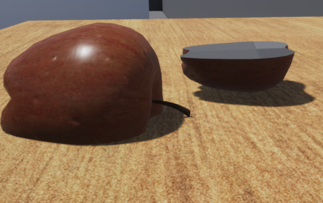

# UCutting

This very small Unreal Engine Plugin implements a simple Cutting functionallity.
For this Objects can be defined as Cutter (e.g: knife) or Cuttable (e.g: Bread). 
Objects which inhert from the cutter class will be able to cut objects which inhert from the cuttable class. Here it is possible to add additional requiremtns if necessary. 
Futhermore it is possible to Query the information of cuttable objects via ROS and "deactivate" cutters. 
Even thought the Plugin is connected to the ROS Environment this is not necessary for the cutting capabilties

## Prerequisits
For the cutting functionallty there are no prerequisits. But in order to futher work with the cutted item it is neceesary to connect to the ROS enviroment, which allows the Controller to ask questions about different cuttables.

## Dependencies
- [UROSBridge](https://github.com/robcog-iai/UROSBridge)
- [UUtils](https://github.com/robcog-iai/UUtils)


## Usage
Example how to create cutter or cuttables. Then how to interconnect it with ROS
and then how to activate, deactivate it via ROS Messages or get additional Information about the cuttable.
### Cutting
The easiest way to cut an object it to create a blueprint class of the provided C++.


Afterwards you can customize it to your wishes


Remember to check if the knife is able to cut, and check that the created BlueprintClass is able to generates Overlap Events otherwise the cutting will fail.


Create a Cuttable the same way, there you do not need to check anything.

Afterwards if the CollisionComponent of the cutter makes Contakt with an cuttable object (and CanCut is true). The cuttable will be cut into two halves





### ROS
Connect the Unreal Engine Simulation to your ROS Environment. For this check out the documentation of UROSBridge [here](https://github.com/robcog-iai/UROSBridge/blob/master/Documentation).

The connection with the ROS Enviorment allows it for Control 
#### The messages
There are two different message types, *ActivateCutter* and *CuttablePartDescription*.


##### CuttablePartDescription
```python
String Name
geometry_msgs.Pose Pose
float height
float width
float depth
```
##### ActivateCutter
```python
String Id
bool bCanCut
```
